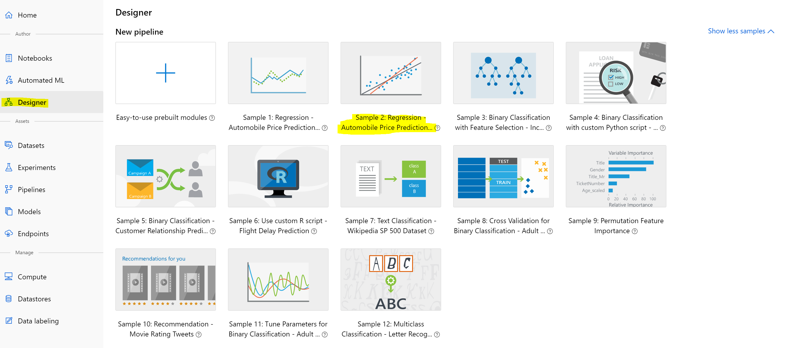

# aml-designer

# Build a Custom Machine Learning Model with a No Code Visual Designer Tool in Azure Machine Learning
### This lab has the steps to create one of the sample projects provided for Azure Machine Learning Service Designer tool. 

1. Go to the Azure ML Resource ml.azure.com
2. Select `Designer` from the left navigation
3. On the right - select the `show more` to expand the view and display all of the options.

4. Click on the tile for the sample project you would like to create. The sample project will be loaded into the experiment workspace in designer.
5. On the right of the project, you will need to select the default compute target.
6. Select `Run` from the top right to run the experiment.
7. Select `new` from the dropdown menu
8. Then give the experiement run a name in the textbox below the dropdown.
9. Click `run` to train the model

## Helpful links to continue learning with Azure Machine Learning Designer

[Azure Machine Learning Docs](https://docs.microsoft.com/en-us/azure/machine-learning/) 
[AML Designer Docs](https://docs.microsoft.com/en-us/azure/machine-learning/service/concept-designer) 
[Tutorial - Designer Automobile Price](https://docs.microsoft.com/en-us/azure/machine-learning/service/tutorial-designer-automobile-price-train-score) 